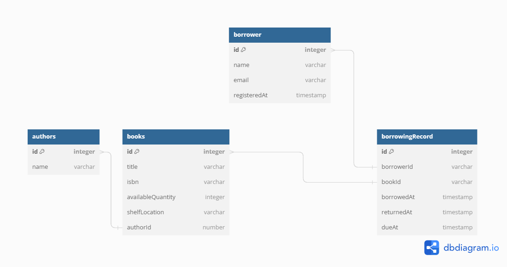

# Library Management System

A REST API for managing books, borrowers and the borrowing process — registration, checkout, returns, and overdue tracking.

## Stack

NestJS · TypeORM · MySQL · class-validator · Swagger

## Features

- Book catalogue with create, update, delete and search
- Borrower registration and management
- Borrowing and returning, with due dates and overdue detection
- CSV export of borrowing reports
- Request validation via DTOs, documented with Swagger

## Running it

```bash
cp .env.example .env     # then fill in your database credentials
yarn install
yarn start:dev
```

Swagger UI is served at `/api`. The database schema is diagrammed in `schema.png`.

## Tests

```bash
yarn test:e2e
```

## Screenshots


